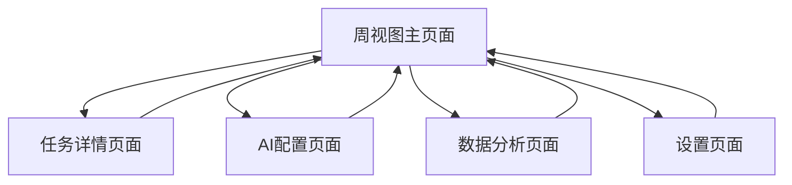

## 1. 产品概述
Align 是一款智能周计划应用，通过 AI 辅助帮助用户高效管理时间和任务。解决传统日程管理工具操作繁琐、缺乏智能建议的问题，为个人用户提供智能化的任务规划和时间管理解决方案。

目标用户为需要高效管理时间的职场人士、学生和自由职业者，通过 AI 技术实现智能任务排程和健康提醒，提升工作生活效率。

## 2. 核心功能

### 2.1 用户角色
本产品为单用户应用，无需区分用户角色。所有功能面向单一用户开放。

### 2.2 功能模块
智能周计划应用包含以下核心页面：
1. **周视图主页面**：周视图日程表、任务创建入口、视图切换
2. **任务详情页面**：任务编辑、子任务管理、优先级设置
3. **AI配置页面**：API配置、AI功能设置、连接测试
4. **数据分析页面**：完成率统计、历史记录查看
5. **设置页面**：工作作息配置、提醒设置、数据管理

### 2.3 页面详情

| 页面名称 | 模块名称 | 功能描述 |
|---------|---------|----------|
| 周视图主页面 | 周视图日程表 | 显示周一至周日网格布局，每日6:00-24:00时间轴，工作日/周末区分显示，当前时间指示线实时更新 |
| 周视图主页面 | 智能任务创建 | 支持自然语言输入，AI自动解析任务信息，提供快速时间选择（今天/明天/本周X/下周X），预设时段选择（早晨/上午/中午/下午/晚上） |
| 周视图主页面 | 任务卡片 | 显示任务标题、时间、优先级颜色标识，支持拖拽调整时间，双击进入详情，右键菜单快速操作 |
| 周视图主页面 | 视图切换 | 支持周视图、日详细视图、列表视图、看板视图切换，键盘快捷键操作 |
| 任务详情页面 | 基本信息编辑 | 编辑任务标题、描述、截止时间，选择任务类别（工作/学习/健康等），设置预估总时长 |
| 任务详情页面 | 优先级设置 | 鼠标滑入显示优先级选择：紧急+重要（红色）、紧急+不重要（橙色）、重要+不紧急（蓝色）、不重要+不紧急（灰色） |
| 任务详情页面 | 子任务管理 | 支持创建两层子任务，第一层主要步骤，第二层具体行动项，每项子任务独立设置状态和预估时间 |
| 任务详情页面 | 状态管理 | 支持6种状态切换：规划中、未开始、进行中、暂停中、已完成、已取消，鼠标滑入快速切换 |
| AI配置页面 | API配置 | 默认硅基流动API配置，可修改端点URL、模型选择、API密钥输入，本地IndexedDB存储，连接测试功能 |
| AI配置页面 | AI功能开关 | 控制自然语言解析、智能时间预估、任务重排、计划生成建议、进度分析预测等功能的启用状态 |
| 数据分析页面 | 完成率统计 | 显示每日/每周完成率，预估vs实际时间对比图表，优先级分布分析 |
| 数据分析页面 | 历史记录 | 查看任务完成历史、时间分配历史、AI建议历史记录 |
| 设置页面 | 工作作息配置 | 设置工作日/周末，支持国家假期数据导入和解析，配置上下班时间、午休时间、排除时间段 |
| 设置页面 | 智能提醒 | 设置任务开始前提醒、超时预警、每日总结提醒，健康提醒（喝水/站立/眼睛休息）时间配置 |
| 设置页面 | 数据管理 | 本地数据导出/导入（JSON格式），自动备份设置，数据清理选项 |

## 3. 核心流程

### 主要用户操作流程：

1. **任务创建流程**：
   - 用户在周视图点击"添加任务"或按空格键
   - 输入自然语言描述（如"明天下午3点开项目会议，预计1小时"）
   - AI自动解析并填充时间、标题、预估时长
   - 用户确认或手动调整信息后保存

2. **任务管理流程**：
   - 查看周视图了解整体安排
   - 拖拽调整任务时间位置
   - 双击任务进入详情页面
   - 编辑任务信息、添加子任务、设置优先级
   - 鼠标滑入快速切换任务状态

3. **AI智能排程流程**：
   - 配置AI API连接信息
   - 启用智能排程功能
   - AI根据任务优先级、截止时间、预估时长自动安排
   - 考虑工作作息和健康提醒，避开非工作时间

4. **数据分析流程**：
   - 查看完成率统计了解执行效果
   - 分析预估vs实际时间差异
   - 根据历史数据优化未来计划

### 页面导航流程图：

## 4. 用户界面设计

### 4.1 设计风格
- **主色调**：深空蓝 (#1a1a2e) 作为主背景，搭配纯白 (#ffffff) 卡片
- **优先级颜色**：红色 (#ef4444)、橙色 (#f97316)、蓝色 (#3b82f6)、灰色 (#6b7280)
- **按钮样式**：圆角矩形设计，主要操作为实心填充，次要操作为边框样式
- **字体选择**：系统默认字体，标题16px，正文14px，小字12px
- **布局风格**：卡片式布局，顶部导航栏，左侧边栏用于视图切换和快速操作
- **图标风格**：使用简洁的线性图标，支持深色模式适配

### 4.2 页面设计概述

| 页面名称 | 模块名称 | UI元素 |
|---------|---------|--------|
| 周视图主页面 | 顶部导航栏 | 应用Logo、当前周显示、视图切换按钮、添加任务按钮、设置入口 |
| 周视图主页面 | 侧边栏 | 快速筛选（全部/工作/学习/健康）、AI功能快捷开关、今日概览卡片 |
| 周视图主页面 | 周视图网格 | 7列网格布局，每列显示日期和星期，24小时时间轴，当前时间红色指示线 |
| 周视图主页面 | 任务卡片 | 圆角矩形卡片，显示标题和时间，优先级左侧边框颜色标识，支持拖拽手柄 |
| 任务详情页面 | 页面头部 | 返回按钮、任务标题编辑、保存按钮、删除按钮 |
| 任务详情页面 | 基本信息区 | 标题输入框、描述文本域、时间选择器、类别选择器、预估时长选择器 |
| 任务详情页面 | 优先级设置 | 四象限矩阵图，点击选择对应优先级，实时预览颜色效果 |
| 任务详情页面 | 子任务区 | 树形结构展示，支持添加/删除/编辑，每层缩进显示，状态标签显示 |
| AI配置页面 | 配置表单 | API端点输入框、模型选择下拉框、API密钥密码框、连接测试按钮 |
| 数据分析页面 | 统计卡片 | 完成率环形图、时间对比柱状图、优先级分布饼图 |

### 4.3 响应式设计
- **桌面优先**：主要面向桌面端用户，优化大屏幕显示效果
- **平板适配**：支持1024px以上宽度，保持核心功能完整
- **移动端支持**：基础查看功能，复杂的编辑操作建议在桌面端完成
- **触摸优化**：支持拖拽操作的触摸手势，按钮大小适配触摸操作

### 4.4 交互细节
- **拖拽反馈**：拖拽时显示半透明副本，目标位置高亮提示
- **悬停效果**：鼠标悬停显示操作按钮和详细信息
- **键盘快捷键**：空格添加任务、ESC取消操作、Enter确认保存
- **加载状态**：操作加载时显示旋转动画，错误时红色提示
- **成功反馈**：操作成功显示绿色提示，2秒后自动消失