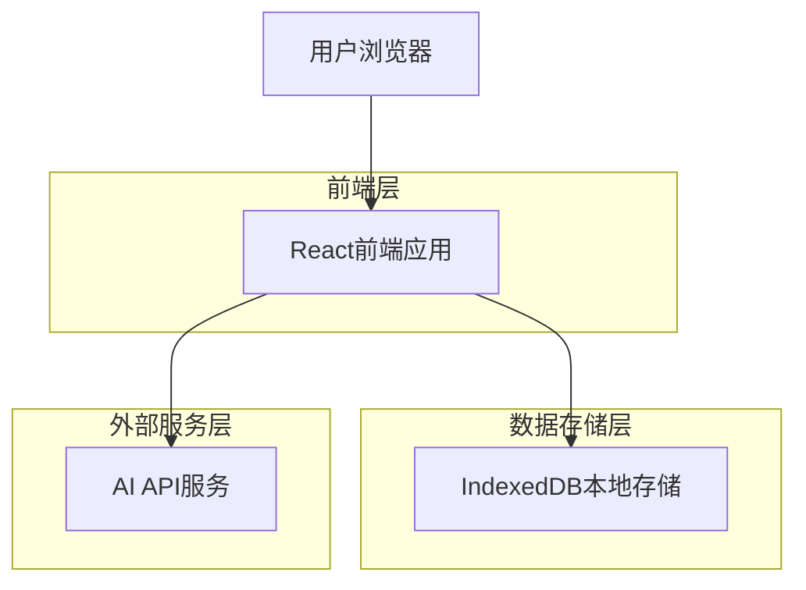
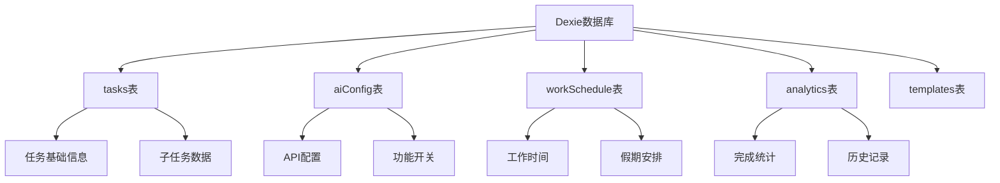
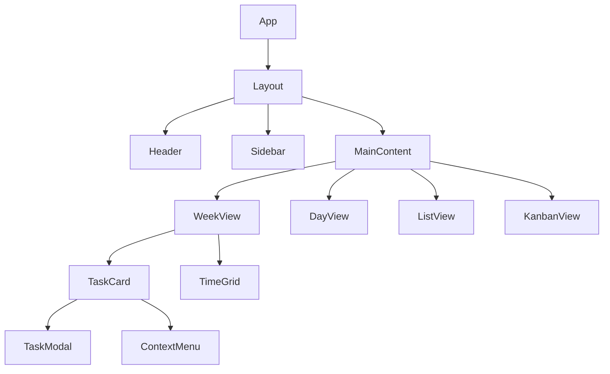

## 1. 架构设计



## 2. 技术描述

- 前端：React@18 + TypeScript + Tailwind CSS@3 + Vite
- 初始化工具：vite-init
- 后端：无（纯前端应用，使用IndexedDB本地存储）
- 状态管理：Zustand（轻量级状态管理）
- UI组件库：shadcn/ui（黑白主题）
- 拖拽交互：React DnD
- 本地存储：Dexie.js（IndexedDB封装）
- AI集成：可配置API层，支持硅基流动等LLM服务

## 3. 路由定义

| 路由 | 用途 |
|------|------|
| / | 周视图主页面，显示核心日程管理界面 |
| /task/:id | 任务详情页面，编辑和管理具体任务 |
| /ai-config | AI配置页面，设置API连接和功能开关 |
| /analytics | 数据分析页面，查看统计和历史记录 |
| /settings | 设置页面，配置工作作息和提醒 |

## 4. 核心数据结构

### 4.1 任务数据结构

```typescript
interface Task {
  id: string;
  title: string;
  description?: string;
  startTime: Date;
  endTime: Date;
  estimatedDuration: number; // 分钟
  priority: 'urgent-important' | 'urgent-unimportant' | 'important-not-urgent' | 'not-important-not-urgent';
  status: 'planning' | 'not-started' | 'in-progress' | 'paused' | 'completed' | 'cancelled';
  category: 'work' | 'study' | 'health' | 'life' | 'other';
  parentId?: string; // 子任务关联
  subtasks: SubTask[];
  createdAt: Date;
  updatedAt: Date;
  completedAt?: Date;
  actualDuration?: number; // 实际用时（分钟）
  aiSuggested?: boolean; // 是否为AI建议
}

interface SubTask {
  id: string;
  title: string;
  status: Task['status'];
  estimatedDuration: number;
  actualDuration?: number;
  order: number;
}
```

### 4.2 AI配置数据结构

```typescript
interface AIConfig {
  apiEndpoint: string;
  apiKey: string;
  model: string;
  enabledFeatures: {
    naturalLanguageParse: boolean;
    timeEstimation: boolean;
    autoSchedule: boolean;
    dailySuggestion: boolean;
    progressAnalysis: boolean;
  };
  healthReminders: {
    waterReminder: boolean;
    waterInterval: number; // 分钟
    standReminder: boolean;
    standInterval: number; // 分钟
    eyeRestReminder: boolean;
    eyeRestInterval: number; // 分钟
  };
}
```

### 4.3 工作作息配置

```typescript
interface WorkSchedule {
  workDays: number[]; // 0-6，周日到周六
  workStartTime: string; // HH:mm格式
  workEndTime: string; // HH:mm格式
  lunchStartTime: string;
  lunchEndTime: string;
  excludedTimeSlots: TimeSlot[];
  holidays: Holiday[];
}

interface TimeSlot {
  startTime: string;
  endTime: string;
  date?: string; // 特定日期，不填则为每天
}

interface Holiday {
  name: string;
  startDate: string;
  endDate: string;
  isWorkDay: boolean; // 调休工作日
}
```

## 5. 本地存储架构

### 5.1 数据库设计



### 5.2 数据表结构

```typescript
// Dexie数据库定义
class AlignDatabase extends Dexie {
  tasks: Dexie.Table<Task, string>;
  aiConfig: Dexie.Table<AIConfig, string>;
  workSchedule: Dexie.Table<WorkSchedule, string>;
  analytics: Dexie.Table<AnalyticsData, string>;
  templates: Dexie.Table<Template, string>;

  constructor() {
    super('AlignDatabase');
    this.version(1).stores({
      tasks: 'id, title, startTime, endTime, status, category, parentId',
      aiConfig: 'id',
      workSchedule: 'id',
      analytics: 'id, date, type',
      templates: 'id, name, type'
    });
  }
}
```

## 6. AI集成架构

### 6.1 API请求结构

```typescript
interface AIRequest {
  prompt: string;
  context?: {
    tasks: Task[];
    schedule: WorkSchedule;
    history: AnalyticsData[];
  };
  feature: 'parse' | 'estimate' | 'schedule' | 'suggest' | 'analyze';
}

interface AIResponse {
  success: boolean;
  data?: {
    parsedTask?: Partial<Task>;
    timeEstimate?: number;
    suggestedSchedule?: Task[];
    dailySuggestion?: string;
    progressAnalysis?: ProgressData;
  };
  error?: string;
}
```

### 6.2 提示词模板

```typescript
const PROMPT_TEMPLATES = {
  parseTask: (input: string) => `
    解析以下任务描述，提取任务的关键信息：
    输入："${input}"
    
    请返回JSON格式：
    {
      "title": "任务标题",
      "description": "详细描述",
      "startTime": "开始时间（ISO格式）",
      "endTime": "结束时间（ISO格式）",
      "estimatedDuration": "预估时长（分钟）",
      "category": "任务类别",
      "priority": "优先级"
    }
  `,
  
  estimateTime: (task: Task, history: AnalyticsData[]) => `
    基于历史数据预估任务所需时间：
    任务：${task.title}，类别：${task.category}
    历史相似任务平均完成时间：${calculateAverageTime(history)}
    
    请预估合理的时间范围（分钟）。
  `
};
```

## 7. 状态管理设计

### 7.1 Zustand Store结构

```typescript
interface AppStore {
  // 任务状态
  tasks: Task[];
  currentWeek: Date;
  selectedView: 'week' | 'day' | 'list' | 'kanban';
  
  // AI状态
  aiConfig: AIConfig;
  isAIProcessing: boolean;
  
  // UI状态
  sidebarOpen: boolean;
  modalState: ModalState;
  
  // 操作方法
  addTask: (task: Task) => void;
  updateTask: (id: string, updates: Partial<Task>) => void;
  deleteTask: (id: string) => void;
  moveTask: (id: string, newStartTime: Date, newEndTime: Date) => void;
  
  // AI操作
  parseNaturalLanguage: (input: string) => Promise<Partial<Task>>;
  autoSchedule: () => Promise<void>;
  generateDailyPlan: () => Promise<string>;
}
```

### 7.2 持久化配置

```typescript
const useAppStore = create<AppStore>()(
  persist(
    (set, get) => ({
      // 初始状态...
      
      // 操作方法实现...
    }),
    {
      name: 'align-storage',
      partialize: (state) => ({
        tasks: state.tasks,
        aiConfig: state.aiConfig,
        currentWeek: state.currentWeek,
        selectedView: state.selectedView
      })
    }
  )
);
```

## 8. 组件架构

### 8.1 核心组件结构



### 8.2 关键组件职责

- **WeekView**: 周视图核心组件，处理周历渲染和任务布局
- **TaskCard**: 任务卡片组件，支持拖拽和状态显示
- **TaskModal**: 任务编辑模态框，管理任务详情编辑
- **AIConfigPanel**: AI配置面板，处理API设置和功能开关
- **AnalyticsDashboard**: 数据分析仪表板，展示统计图表

## 9. 性能优化策略

### 9.1 渲染优化
- 使用React.memo优化TaskCard组件重渲染
- 虚拟滚动处理大量任务列表
- 时间分片处理复杂排程算法

### 9.2 存储优化
- Dexie.js的批量操作减少IndexedDB写入次数
- 数据分页加载，避免一次性加载所有历史数据
- 图片和附件使用Blob存储，减少内存占用

### 9.3 AI请求优化
- 请求防抖处理，避免频繁调用AI API
- 本地缓存AI响应结果，相同输入直接返回
- 请求失败重试机制，提高可靠性